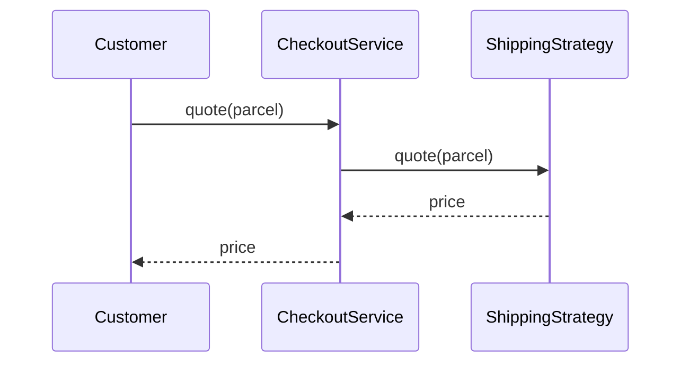

# Guide 06 — Strategy

**Lab:** [Requirements](../../phases/phase-06/requirements.md) · [Guided check](../../phases/phase-06/guided-check.md) · [Questions](../../phases/phase-06/questions.md)

## Chapter 6: "Shipping quotes at CartNest"

A customer checks out a 2 kg parcel going 100 km on **CartNest**. Checkout must price **standard**, **express**, and **economy**. The first `CheckoutService` does every formula itself with `if method == ...`. Finance asks for **green** and that method breaks.

You need **Strategy**: interchangeable algorithms behind one interface. Checkout holds one strategy and calls `quote`.

*Head First Design Patterns* introduces Strategy in Chapter 1. Refactoring Guru: ([Strategy](https://refactoring.guru/design-patterns/strategy)).

---

## Learning Objectives

By the end of this guide you will be able to:

- State Strategy’s intent
- Separate “decide which algorithm” from “run the algorithm”
- Swap policies without rewriting the context
- Contrast Strategy with State
- Bridge the idea to Phase 6 without copying CartNest types

---

## Theory

### Intent

**Strategy** defines a family of algorithms, encapsulates each one, and makes them interchangeable. Strategy lets the algorithm vary independently from clients that use it. The context object holds a reference to a strategy and delegates work to it.

*Head First Design Patterns* introduces Strategy in Chapter 1. Refactoring Guru: extract varying behavior into objects you can swap at runtime ([Strategy](https://refactoring.guru/design-patterns/strategy)).

### The problem in plain language

A service method grows a column of `if method == "standard"` / `elif method == "express"` branches. Each branch encodes a different formula, policy, or ruleset. New requirements—green shipping, regional pricing, loyalty discounts—force edits to the same hotspot. Tests must cover every branch combination. Two developers cannot extend different policies without merge conflicts.

The recurring issue: **algorithms and selection logic are fused**. The context knows too much about how each variant works.

### Analogy — GPS routing apps

You open a navigation app and tap “Navigate to the airport.” The UI stays the same; behind the scenes you pick a **route strategy**: fastest, avoid tolls, scenic, or eco-friendly. Each strategy computes a path differently using the same map data. Switching strategies does not rewrite the “start navigation” button—it swaps the engine plugged into a stable shell. Swapping green shipping for express does not rewrite CartNest checkout either; it swaps the formula plugged into `CheckoutService`.

In software, the **context** is the navigation shell; each **strategy** is a route algorithm selected by configuration or user choice.

### Solution structure

| Role | Responsibility | In Phase 6 lab |
| ---- | -------------- | -------------- |
| **Strategy** | Interface for the varying algorithm | `IrrigationPolicy`, `LightingPolicy`, … |
| **Concrete strategy** | One algorithm implementation | Conservative vs aggressive moisture rules |
| **Context** | Holds strategy; delegates | `GreenhouseContext` (uses `location_id`) |
| **Client** | Configures or swaps strategy | API setting automation mode per zone |

The context should not contain `if conservative ... elif aggressive ...` for the core calculation—it calls `strategy.decide(readings, thresholds)`.

### How collaboration works



Swapping strategy means injecting a different object—often at startup, per request, or when the operator changes policy in the UI.

### When to use / when to skip

**Use Strategy when:**

- Multiple algorithms implement the same conceptual operation (price shipping, choose irrigation, rank search results).
- The algorithm should change at runtime without modifying the context class.
- You want each policy in its own testable class.

**Skip or simplify when:**

- Behavior varies because of **lifecycle mode** (open vs closed ticket)—State may fit better (Guide 08).
- Only one algorithm exists and will never vary.
- The “strategies” are tiny one-liners—a dict of functions can be enough until complexity grows.

### Related patterns

- **State** — structurally similar (delegate to a polymorphic object), but State objects represent **modes** that change as the machine evolves; Strategy objects are usually **chosen by the client** and represent interchangeable policies. Confusing them is common—ask “who changes the active object?”
- **Template Method** — fixed skeleton in a base class, varying steps in subclasses; inheritance-based rather than composition-based swapping.
- **Command** — encapsulates a request as an object; Strategy encapsulates an algorithm. Command can carry undo/history; Strategy focuses on calculation.

---

# Part 2 — Follow along

> **Follow along:** Stdlib Python only. Run the problem demo first, then the complete strategy script.

## 1. The sticky problem

Same afternoon. The customer is still at the counter. Checkout has no separate formulas, so the clerk does the arithmetic in one method.

### 1.1 Smell: the clerk prices every method

```python
# The clerk does every formula at the counter. A new method means editing this method.
if method == "standard":
    return 5.0 + 0.02 * parcel.distance_km
if method == "express":
    return 12.0 + 0.05 * parcel.distance_km + 0.5 * parcel.weight_kg
```

**Root cause:** Algorithms and selection live in one class.

### 1.2 Runnable problem demo

> **Follow along:** Save as `cartnest_before.py`, run `python cartnest_before.py`.

```python
"""Monday afternoon at CartNest. Checkout prices every method itself."""

from dataclasses import dataclass


@dataclass
class Parcel:
    weight_kg: float
    distance_km: float


class CheckoutService:
    """Context, still fused to every formula. There is no strategy object yet."""

    def shipping_quote(self, parcel: Parcel, method: str) -> float:
        # Selection and arithmetic share one method. Green has nowhere to go.
        if method == "standard":
            return 5.0 + 0.02 * parcel.distance_km
        if method == "express":
            return 12.0 + 0.05 * parcel.distance_km + 0.5 * parcel.weight_kg
        if method == "economy":
            return max(3.0, 0.01 * parcel.distance_km + 0.2 * parcel.weight_kg)
        raise ValueError(method)


if __name__ == "__main__":
    parcel = Parcel(weight_kg=2, distance_km=100)
    svc = CheckoutService()
    print("A customer checks out a 2 kg parcel, 100 km away.")
    print(f"Checkout itself prices standard: {svc.shipping_quote(parcel, 'standard')}")
    print(f"Checkout itself prices express: {svc.shipping_quote(parcel, 'express')}")
    try:
        svc.shipping_quote(parcel, "green")
    except ValueError as exc:
        print(f"PAIN: {exc} — adding green means editing CheckoutService again")
```

**Expected output (problem):**

```text
A customer checks out a 2 kg parcel, 100 km away.
Checkout itself prices standard: 7.0
Checkout itself prices express: 18.0
PAIN: green — adding green means editing CheckoutService again
```

### What goes wrong when requirements change

Ask for green, and you edit `CheckoutService` again. Two developers cannot add two formulas without colliding in the same method.

---

## 2. Pattern in practice

The formulas leave the counter. Each one stands as its own strategy. Checkout only asks for a price.

---

## 3. Building the solution (step by step)

### Step A — One formula steps out of the method

```python
class ShippingStrategy(ABC):
    @abstractmethod
    def quote(self, parcel: Parcel) -> float:
        """The price the counter asks for — no method name in here."""
        ...


class StandardShipping(ShippingStrategy):
    def quote(self, parcel: Parcel) -> float:
        return 5.0 + 0.02 * parcel.distance_km
```

### Step B — The counter only asks for a price

```python
class CheckoutService:
    def __init__(self, strategy: ShippingStrategy) -> None:
        self._strategy = strategy  # context holds the strategy; it does not switch on names

    def shipping_quote(self, parcel: Parcel) -> float:
        return self._strategy.quote(parcel)
```

### Step C — The customer picks a formula outside the counter

```python
# Selection stays outside the algorithm. A new method is a new object, not a new branch.
STRATEGIES = {"standard": StandardShipping(), "express": ExpressShipping(), ...}
strategy = STRATEGIES[method]
CheckoutService(strategy).shipping_quote(parcel)
```

---

## 4. Complete worked solution (runnable)

> **Follow along:** Save as `cartnest_strategy.py`, run `python cartnest_strategy.py`.

```python
"""Later that afternoon. Four formulas, one checkout counter (stdlib only)."""

from abc import ABC, abstractmethod
from dataclasses import dataclass


@dataclass(frozen=True)
class Parcel:
    weight_kg: float
    distance_km: float


class ShippingStrategy(ABC):
    """Strategy. The only question checkout asks: what does this parcel cost?"""

    @abstractmethod
    def quote(self, parcel: Parcel) -> float:
        ...


class StandardShipping(ShippingStrategy):
    """One formula. It does not know about express, economy, or green."""

    def quote(self, parcel: Parcel) -> float:
        return 5.0 + 0.02 * parcel.distance_km


class ExpressShipping(ShippingStrategy):
    def quote(self, parcel: Parcel) -> float:
        return 12.0 + 0.05 * parcel.distance_km + 0.5 * parcel.weight_kg


class EconomyShipping(ShippingStrategy):
    def quote(self, parcel: Parcel) -> float:
        return max(3.0, 0.01 * parcel.distance_km + 0.2 * parcel.weight_kg)


class GreenShipping(ShippingStrategy):
    """A new formula object. Checkout does not grow an elif for it."""

    def quote(self, parcel: Parcel) -> float:
        return EconomyShipping().quote(parcel) + 1.50


class CheckoutService:
    """Context. It holds a strategy and reads the price aloud."""

    def __init__(self, strategy: ShippingStrategy) -> None:
        self._strategy = strategy

    def set_strategy(self, strategy: ShippingStrategy) -> None:
        self._strategy = strategy

    def shipping_quote(self, parcel: Parcel) -> float:
        return self._strategy.quote(parcel)


STRATEGIES: dict[str, ShippingStrategy] = {
    "standard": StandardShipping(),
    "express": ExpressShipping(),
    "economy": EconomyShipping(),
    "green": GreenShipping(),
}


def quote_for(method: str, parcel: Parcel) -> float:
    """Selection lives here, outside CheckoutService.shipping_quote."""
    return CheckoutService(STRATEGIES[method]).shipping_quote(parcel)


if __name__ == "__main__":
    parcel = Parcel(weight_kg=2, distance_km=100)
    print("The customer asks for a quote again.")
    print(f"Standard answers from its own formula: {quote_for('standard', parcel)}")
    print(f"Express answers from its own formula: {quote_for('express', parcel)}")
    print(f"Economy answers from its own formula: {quote_for('economy', parcel)}")
    print(
        "Green is a new formula, not a new branch in checkout: "
        + str(quote_for("green", parcel))
    )
    print("Checkout never learned the arithmetic.")
```

**Expected output (solution):**

```text
The customer asks for a quote again.
Standard answers from its own formula: 7.0
Express answers from its own formula: 18.0
Economy answers from its own formula: 3.0
Green is a new formula, not a new branch in checkout: 4.5
Checkout never learned the arithmetic.
```

---

## 5. Compare & contrast

| | Strategy | State (Guide 08) |
|--|----------|------------------|
| Why behavior changes | Client chose a policy | Object’s internal mode changed |
| Example | Express vs economy quote | Ticket open vs closed actions |

---

## 6. Watch out for these traps

- Strategies that secretly charge cards / call actuators
- One mega-strategy with internal `if`s
- Porting `ShippingStrategy` names into irrigation policies

---

## 7. Try this

A midnight truck leaves after the counter closes. Add `OvernightShipping` (flat 25 + 1 per kg). Register it under `"overnight"` and print a quote. `CheckoutService.shipping_quote` stays unchanged. The new formula stays inside the new strategy.

---

## Key Terms

| Term | Definition |
|------|------------|
| **Strategy** | Behavioral pattern for interchangeable algorithms |
| **Context** | Object that delegates to a strategy |

---

## Reading Assignments

**Required:**

- *Head First Design Patterns* — Chapter 1 (Strategy intro)
- [Refactoring Guru — Strategy](https://refactoring.guru/design-patterns/strategy)
- Lab: [Requirements](../../phases/phase-06/requirements.md) · [Guided check](../../phases/phase-06/guided-check.md) · [Questions](../../phases/phase-06/questions.md)

---

## Bridge to your lab

Phase 6 uses Strategy for automation decision policies. Keep “decide” separate from “execute” (Command comes later).

| Teaching (this guide) | Your lab (greenhouse) |
| --------------------- | --------------------- |
| `ShippingStrategy.quote` / `decide` | `AutomationStrategy.decide(context)` |
| `StandardShipping` / `ExpressShipping` | Conservative vs aggressive moisture (lab keys) |
| `Parcel` (input to the algorithm) | One `LocationAutomationContext` per zone (that zone’s band + moisture from sensors with that `zone_id`) |
| `CheckoutService` picking a strategy | Automation service: load key from DB, build one context per zone, call `decide`. The evaluate result stays one `action` and `reason` |

**Do / don’t:** **Do** build each context from persisted readings of sensors in that zone and from that zone’s thresholds (not hardcoded numbers). An empty zone does not use an unassigned device. **Don’t** import SQLAlchemy into strategy classes, and don’t run pumps inside `decide()` — Command is Phase 10.

---

## Summary

- Algorithms buried in conditionals fight change.
- Strategy extracts each algorithm behind one interface.
- Prefer Strategy for selectable policies; State for lifecycles.

**Next:** [Guide 07 — Facade](./07-facade.md)
